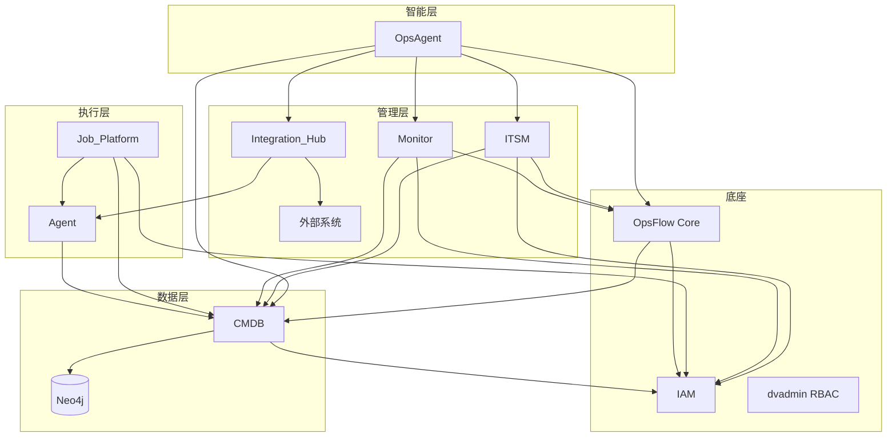

# OPSflow 全平台开发进度汇总

> 最后更新: 2026-06-28 | 参考目标: docs/opsflow_target.md

---

## 一、平台总览

| 子产品 | 成熟度 | 目标 | 差距 | Python 文件 | 模型数 | ViewSets | API 端点 | 前端状态 |
|-------|:----:|:----:|:----:|:----------:|:-----:|:--------:|:--------:|:-------:|
| **OpsFlow** | 5/5 ✅ | 5/5 | — | 233 | 21 | 14 | 99+ | 完整 |
| **IAM** | 5/5 ✅ | 5/5 | — | 18 | 10 | 6 | ~46 | 完整 |
| **CMDB** | 4/5 🟢 | 5/5 | Mock数据替换、Agent发现 | — | 11 | 13 | ~25 | 基础 |
| **ITSM** | 4/5 🟢 | 5/5 | AI LLM接入、双向OpsFlow | — | 18 | 16 | ~50 | 完整 |
| **Monitor** | 4/5 🟢 | 5/5 | 自愈闭环、Prometheus | — | 18 | — | ~20 | 完整 |
| **Job Platform** | 3/5 🟡 | 5/5 | SSH执行器阻塞、文件分发 | — | 14 | — | ~15 | 基础 |
| **Integration Hub** | 3/5 🟡 | 5/5 | 凭证加密、运行监控 | — | 3 | — | ~10 | 基础 |
| **OpsAgent** | 3/5 🟡 | 5/5 | 工具链不完善、多轮操作 | — | 5 | — | ~10 | 基础 |
| **Agent** | 2/5 🔴 | 5/5 | 批量纳管、升级编排、安全认证 | Go 2800行 | Python 6 | 7+4 | ~15 | 基础 |

---

## 二、成熟度矩阵（按 opsflow_target.md）

| 子产品 | 成熟度 | 核心引擎 | 前端页面 | API 端点 | 测试覆盖 | 文档 |
|-------|:----:|:--------:|:--------:|:--------:|:-------:|:----:|
| **OpsFlow** | ⭐⭐⭐⭐⭐ | ✅ 完整 | ✅ 21 组件 | ✅ 99+ | ⚠️ 基础(252+) | ✅ 完整 |
| **IAM** | ⭐⭐⭐⭐⭐ | ✅ 完整 | ✅ 完整 | ✅ ~46 | ❌ 无 | ✅ 完整 |
| **dvadmin** | ⭐⭐⭐⭐⭐ | ✅ 完整 | ✅ 完整 | ✅ 完整 | — | ✅ |
| **CMDB** | ⭐⭐⭐⭐☆ | 🔄 Neo4j 重构完成 | ✅ 拓扑+表格 | ⚠️ ~25 端点 | ❌ 无 | 🔄 |
| **ITSM** | ⭐⭐⭐⭐☆ | ✅ 基础 | ✅ 完成 | ✅ ~50 | ❌ 无 | 🔄 |
| **Monitor** | ⭐⭐⭐⭐☆ | ✅ 基础 | ✅ 完成 | ✅ ~20 | ❌ 无 | 🔄 |
| **Open API** | ⭐⭐⭐⭐☆ | ✅ Token+限流 | ✅ 基础 | ✅ 基础 | — | 🔄 |
| **Portal** | ⭐⭐⭐⭐☆ | — | ✅ 完成 | — | — | — |
| **Integration Hub** | ⭐⭐⭐☆☆ | ✅ 基础 | ✅ 基础 | ✅ ~10 | — | 🔄 |
| **Job Platform** | ⭐⭐⭐☆☆ | 🔄 完善中 | ✅ 基础 | ✅ ~15 | — | 🔄 |
| **OpsAgent** | ⭐⭐⭐☆☆ | 🔄 完善中 | ✅ 基础 | ✅ ~10 | — | 🔄 |
| **Agent** | ⭐⭐☆☆☆ | 🔄 需完善 | ✅ 基础 | ✅ ~15 | — | — |
| **CI/CD + K8s** | ⭐☆☆☆☆ | 📅 规划 | — | — | — | — |

---

## 三、各子产品 TODO 汇总

### P0 — 高优先级（商业就绪门槛）

| 子产品 | 任务 |
|--------|------|
| **Agent** | internal_views 添加 APIToken 校验（当前 csrf_exempt 无认证） |
| **Agent** | 修复 agent_file_pull 插件（server 端无 pull endpoint） |
| **Job Platform** | 修复 _resolve_targets() 返回空列表问题（SSH 执行器阻塞） |

### P1 — 中优先级

| 子产品 | 任务 |
|--------|------|
| **CMDB** | 替换 8 组 Mock 数据为真实 Neo4j 查询 |
| **CMDB** | Agent 自动发现全链路打通（collect → Neo4j → CMDB API） |
| **CMDB** | MainlineTopo 前端树图渲染 |
| **CMDB** | 腾讯云/Huawei 云同步实现 |
| **CMDB** | DR 拓扑 G6 可视化 |
| **CMDB** | CMDB 自监控策略（Neo4j 健康检查） |
| **ITSM** | AIGenerator 接入 DeepSeek |
| **ITSM** | 服务目录完整实现 |
| **Monitor** | ActionPlugin 插件完善（通知/恢复/自愈脚本） |
| **Monitor** | 告警升级逻辑完整实现 |
| **Integration** | 凭证加密存储（vault/django-fernet-fields） |
| **Integration** | AI 连接器可用性监控 |
| **Job Platform** | SSH 执行器批量分发完整 |
| **Job Platform** | Agent 执行器完整继承 |
| **Job Platform** | 文件分发实现 |
| **OpsAgent** | Monitor/ITSM 工具链完善（alert_ack/itsm_ticket_create） |
| **OpsAgent** | APIMode 安全评估（当前 auto-approve 所有调用） |
| **Agent** | 批量 Agent 纳管 |
| **Agent** | 升级编排 UI/API |
| **Agent** | 实时结果流（Seq/IsFinal 仅返回一次 final） |
| **Agent** | 文件 Pull 实现 |
| **Operator** | GitStats > 30% |

### P2 — 低优先级

| 子产品 | 任务 |
|--------|------|
| **OpsFlow** | 模板自动保存冲突提示 |
| **OpsFlow** | CI/CD + K8s 部署支持 |
| **OpsFlow** | ~~扩充测试覆盖率~~ → ✅ 252+ 测试（框架统一+API+E2E全覆盖） |
| **CMDB** | AI DR Pipeline 生成 |
| **CMDB** | K8s CMDB 模型 |
| **CMDB** | 网络设备模型 |
| **CMDB** | 实例级 RBAC |
| **ITSM** | OpsFlow 审批节点 ↔ ITSM 工单双向 |
| **ITSM** | Monitor 告警 → 创建工单 |
| **ITSM** | 变更日历前端 |
| **ITSM** | SlaPolicy 字段命名对齐 |
| **Monitor** | 自愈策略 → OpsFlow 触发全链路 |
| **Monitor** | 自愈闭环（流程完成→更新告警状态） |
| **Monitor** | Prometheus + Grafana docker-compose |
| **Monitor** | 4 条预置告警规则 |
| **Monitor** | Monitor 自监控策略 seed |
| **Monitor** | WebSocket 实时推送 |
| **Integration** | 运行监控（熔断/重试） |
| **Integration** | 连接池管理 |
| **Integration** | 协议适配扩展 |
| **Job Platform** | 执行账户管理 + vault 集成 |
| **Job Platform** | CronJob 定时执行 |
| **Job Platform** | OpsFlow 原子插件集成 |
| **OpsAgent** | 多轮复杂操作编排 |
| **OpsAgent** | 工具链扩展 |
| **Agent** | Windows/AIX 安装脚本 |
| **Agent** | TLS 加密通信 |
| **Agent** | 前端实时推送 |
| **Agent** | 流式输出完善 |
| **Agent** | 多租户隔离 |
| **Agent** | 补充测试用例 |

---

## 四、商业就绪检查清单（来自 TODO.md）

### Phase 0 — 安全底线 + 部署可跑（1 周）

| # | 项目 | 状态 | 说明 |
|---|------|:----:|------|
| 1 | Nginx 配置文件 | 📅 | `deploy/nginx/nginx.conf` 不存在 |
| 2 | SECRET_KEY + 数据库密码环境变量化 | 📅 | 现硬编码在 `conf/env_base.py` 和 `settings.py` |
| 3 | CORS_ORIGIN_ALLOW_ALL = False | 📅 | 现为 True，任何网站可调用 API |
| 4 | 前端 error boundary | 📅 | 无 `onErrorCaptured`，组件报错整个页面白屏 |
| 5 | Sentry 接入 | 📅 | 无错误上报，生产问题只能盲猜 |
| 6 | docker-compose 全流程跑通验证 | 📅 | `git clone → docker compose up` 能完整看到登录页 |

### Phase 1 — 工程化 + 测试 + 加固（3 周）

| # | 项目 | 状态 | 说明 |
|---|------|:----:|------|
| 1 | GitHub Actions CI | 📅 | 无 CI，改动无验证 |
| 2 | 登录频率限制 + 验证码 | 📅 | 暴力破解无防护 |
| 3 | 核心模块测试 (cmdb/opsflow ≥30%) | 🔄 | opsflow 252+ 测试（统一框架+API集成+E2E全覆盖），cmdb 零测试 |
| 4 | 修复 6 处 bare except | 📅 | 生产环境静默吞异常 |
| 5 | 数据库自动备份脚本 | 📅 | 无备份策略 |
| 6 | 环境变量文档 + .env.example | 📅 | 部署所需环境变量无文档 |

### Phase 2 — 业务补齐（6 周）

| # | 项目 | 状态 | 说明 |
|---|------|:----:|------|
| 1 | K8s CMDB 模型 + ACK 同步 | 📅 | 企业必问场景，当前完全缺失 |
| 2 | Agent 自动安装流程完善 | 🔄 | push_install 单台可跑，批量未完 |
| 3 | 网络设备模型 | 📅 | Router/Switch/Firewall 纳管 |
| 4 | CMDB 导入导出 | 🔄 | 后端 Excel 完整，前端未完全对接 |
| 5 | Prometheus /metrics 端点 | 📅 | 应用自监控，便于 SRE 团队接管 |
| 6 | Neo4j 数据校验 + 迁移机制 | 📅 | 图数据库无 schema 校验 |
| 7 | 其他 CMDB 同步实现 | 🔄 | 腾讯云骨架、AWS 仅 provider_choices |

### Phase 3 — 监控 + 文档 + 打磨（6 周）

| # | 项目 | 状态 | 说明 |
|---|------|:----:|------|
| 1 | Prometheus + Grafana 内嵌 docker-compose | 📅 | specs 已设计，待实施 |
| 2 | 4 条告警规则 | 📅 | Celery worker 离线、Neo4j 不可用、CMDB 同步失败、磁盘空间 |
| 3 | Grafana 预置看板 | 📅 | 系统总览、Celery、CMDB 同步、Neo4j 健康 |
| 4 | 监控模块自监控策略 | 📅 | seed_reference 中预置策略 |
| 5 | /readiness 加固 | 📅 | 补充 Redis + Neo4j 连通性检查 |
| 6 | 部署文档 + 架构文档 | 📅 | 交付标配产出 |
| 7 | 运维手册 | 📅 | 升级、备份、扩容、排障标准流程 |
| 8 | 前端 i18n 全面检查 | 🔄 | 多页面切换英文仍有中文残留 |
| 9 | 前端测试（核心页面） | 📅 | 保证重构不改坏 |
| 10 | API 文档自动化完善 | 📅 | drf-spectacular description 大量缺省 |
| 11 | demo data 脚本 | 📅 | `python manage.py seed_demo` 即可看到完整数据 |

---

## 五、关键依赖关系



---

## 六、建议实现路径

> 基于 opsflow_target.md 五层架构 + TODO 依赖关系 + 优先级矩阵，按层次自底向上推进。

### 路径总览（螺旋迭代模式）

```
Round 1: 底座加固（安全+基础设施）         → 2-3周
  ├── IAM 安全完善
  ├── Agent 安全认证
  ├── Integration 凭证加密
  └── 部署安全底线（Phase 0）

Round 2: 数据底座补全（CMDB 核心）        → 3-4周
  ├── CMDB Mock → 真实 Neo4j
  ├── Agent 自动发现全链路
  ├── CMDB 导入导出完整
  └── 进程拓扑增量更新

Round 3: 执行引擎完善（Agent + Job）       → 4-5周
  ├── Agent 批量纳管 + 升级编排
  ├── Job Platform SSH/Agent 执行器
  ├── Agent 文件 Pull
  └── 流式输出 + 实时推送

Round 4: 闭环与智能化                     → 4-5周
  ├── Monitor 自愈闭环
  ├── ITSM 双向审批贯通
  ├── OpsAgent 工具链扩展
  └── AI 生成能力完善

Round 5: 运维保障（监控+文档+CI）         → 3-4周
  ├── Prometheus + Grafana
  ├── CI/CD Pipeline
  ├── 部署/运维文档
  └── i18n 全面检查 + demo data
```

---

### Round 1: 底座加固（安全+基础设施）— P0 必做

**目标：让平台可安全部署、可信任运行**

| 序号 | 子产品 | 任务 | 层次 | 工作量 | 依赖 |
|:----:|--------|------|------|:----:|------|
| R1.1 | **Operator** | Nginx 配置 + docker-compose 验证 | Presentation | 2d | — |
| R1.2 | **Operator** | SECRET_KEY/数据库密码环境变量化 | Data | 1d | — |
| R1.3 | **Operator** | CORS 限制 + error boundary + Sentry | Presentation | 2d | — |
| R1.4 | **Agent** | internal_views APIToken 校验 | API | 1d | — |
| R1.5 | **Agent** | agent_file_pull 修复 | Execution | 1d | — |
| R1.6 | **Integration** | 凭证加密存储（fernet-fields） | Core | 2d | — |
| R1.7 | **Operator** | GitHub Actions CI | — | 2d | — |
| R1.8 | **Operator** | 登录频率限制 + 验证码 | API | 1d | — |

**验收标准：** `git clone → docker compose up → 登录 → 安全基线检查通过`

---

### Round 2: 数据底座补全（CMDB 核心）— P1

**目标：CMDB 成为所有子产品的真实数据源**

| 序号 | 子产品 | 任务 | 层次 | 工作量 | 依赖 |
|:----:|--------|------|------|:----:|------|
| R2.1 | **CMDB** | 替换 8 组 Mock 数据为真实 Neo4j 查询 | Data | 5d | — |
| R2.2 | **CMDB** | Agent 自动发现全链路打通 | Execution→Data | 3d | R2.1 |
| R2.3 | **CMDB** | MainlineTopo 前端树图渲染 | Presentation | 2d | R2.1 |
| R2.4 | **CMDB** | 进程拓扑增量更新（当前全量） | Data | 2d | R2.2 |
| R2.5 | **CMDB** | Excel 导入导出前端完整对接 | API | 2d | R2.1 |
| R2.6 | **CMDB** | 腾讯云同步骨架→完整实现 | Execution | 3d | R2.1 |
| R2.7 | **Operator** | 数据库自动备份脚本 | Data | 1d | — |
| R2.8 | **Operator** | Neo4j 数据校验 + 迁移机制 | Data | 2d | R2.1 |

**验收标准：** CMDB 实例从 Neo4j 真实查询返回；Agent 采集数据可追溯到 CMDB 拓扑

---

### Round 3: 执行引擎完善（Agent + Job Platform）— P1

**目标：远程执行通道可靠、批量纳管可用**

| 序号 | 子产品 | 任务 | 层次 | 工作量 | 依赖 |
|:----:|--------|------|------|:----:|------|
| R3.1 | **Job Platform** | 修复 _resolve_targets() + SSH 批量分发 | Execution | 3d | R2.1(R2.1) |
| R3.2 | **Job Platform** | Agent 执行器完整继承 | Execution | 2d | R1.4 |
| R3.3 | **Job Platform** | 文件分发实现 | Execution | 2d | R3.1 |
| R3.4 | **Agent** | 批量纳管（push_install multi-host） | Execution | 3d | R1.4 |
| R3.5 | **Agent** | 升级编排 UI/API | Presentation(UI) + API | 2d | R3.4 |
| R3.6 | **Agent** | 实时结果流（Seq/IsFinal multi-chunk） | Execution | 2d | R3.4 |
| R3.7 | **Agent** | 文件 Pull 完整实现 | Execution | 2d | R3.4 |
| R3.8 | **Integration** | 运行监控（连接健康检查 + 统计） | Core | 2d | — |

**验收标准：** SSH/Agent 双通道远程执行脚本成功；Agent 批量安装 10+ 台主机

---

### Round 4: 闭环与智能化 — P1/P2

**目标：监控自愈闭环 + AI 运维决策链完整**

| 序号 | 子产品 | 任务 | 层次 | 工作量 | 依赖 |
|:----:|--------|------|------|:----:|------|
| R4.1 | **Monitor** | 自愈策略 → OpsFlow 触发全链路 | Core→Execution | 3d | R3.1 |
| R4.2 | **Monitor** | 自愈闭环（流程完成→关闭告警） | Core | 1d | AA4.1 |
| R4.3 | **ITSM** | OpsFlow 审批节点 ↔ ITSM 工单双向 | Core | 3d | — |
| R4.4 | **Monitor** | 告警自动创建 ITSM 工单 | Core | 2d | R4.3 |
| R4.5 | **ITSM** | AIGenerator 接入 DeepSeek | Core | 2d | — |
| R4.6 | **OpsAgent** | Monitor/ITSM 工具链（alert_ack/itsm_create） | Core | 2d | R4.1, R4.3 |
| R4.7 | **OpsAgent** | APIMode 安全评估（替换 auto-approve） | Core | 2d | — |
| R4.8 | **CMDB** | DR 拓扑 G6 力导向图 + AI DR Pipeline | Data+Presentation | 3d | R2.1 |
| R4.9 | **ITSM** | 服务目录完整实现 | API | 3d | — |

**验收标准：** 告警触发→自愈流程执行→告警关闭，全自动闭环

---

### Round 5: 运维保障（监控+文档+CI）— P2/TODO Phase3

**目标：生产级可运维、可交付**

| 序号 | 子产品 | 任务 | 层次 | 工作量 | 依赖 |
|:----:|--------|------|------|:----:|------|
| R5.1 | **Monitor** | Prometheus + Grafana docker-compose | Execution(Infra) | 3d | — |
| R5.2 | **Monitor** | 4 条预置告警规则 + 看板 | Core | 2d | R5.1 |
| R5.3 | **Operator** | 核心模块测试 ≥30% 覆盖率 | — | 5d | — |
| R5.4 | **Operator** | 修复 6 处 bare except | — | 1d | — |
| R5.5 | **Operator** | /readiness 加固（Redis + Neo4j） | API | 1d | — |
| R5.6 | **Operator** | 部署文档 + 架构文档 + 运维手册 | — | 3d | — |
| R5.7 | **Operator** | 前端 i18n 全面检查 | Presentation | 2d | — |
| R5.8 | **Operator** | API 文档自动化完善 | API | 2d | — |
| R5.9 | **Operator** | demo data 脚本 | — | 2d | — |
| R5.10 | **OpsFlow** | 模板冲突提示 | Presentation | 2d | — |

**验收标准：** `docker compose up` 启动 Prometheus+Grafana，预置看板正常显示

---

### 依赖热图

```
产品 \ 轮次    R1(安全)  R2(数据)  R3(执行)  R4(闭环)  R5(保障)
─────────────────────────────────────────────────────────
IAM              ■         
OpsFlow                                    □         ■  
CMDB                       ■■■■          ■              
ITSM                                    ■■■■           
Monitor                                ■■■          ■■  
Job Platform                       ■■■                 
Integration       ■                      ■              
OpsAgent                                ■■             
Agent             ■■              ■■■■■                 
Operator          ■■■        ■           □         ■■■■
```

---

### 工作量估算

| 轮次 | 任务数 | 估算工作日 | 建议日历 |
|:----:|:-----:|:---------:|:--------|
| R1 — 底座加固 | 8 | 12d | 2-3周 |
| R2 — 数据底座 | 8 | 22d | 3-4周 |
| R3 — 执行引擎 | 8 | 18d | 4-5周 |
| R4 — 闭环智能 | 9 | 22d | 4-5周 |
| R5 — 运维保障 | 10 | 24d | 3-4周 |
| **合计** | **43** | **~98d** | **~20周** |

> 注：单人估算，多人并行可显著缩短。建议优先级：安全(R1)→数据(R2)→执行(R3)→闭环(R4)→保障(R5)。

---

## 七、版本里程碑建议

| 版本 | 聚焦 | 预计 | 说明 |
|:----:|------|:----:|------|
| **v1.0** | 商业就绪安全底线 | Phase 0 完成 | Nginx/Secret/CRORS/Sentry/docker-compose |
| **v1.1** | 工程化+测试 | Phase 1 完成 | CI/测试/频率限制/备份/文档 |
| **v1.5** | 业务补齐 | Phase 2 完成 | K8s/Agent纳管/网络设备/Metrics |
| **v2.0** | 监控+打磨 | Phase 3 完成 | Prometheus/文档/i18n/测试/demo |
| **v2.5** | Agent 全功能 | Agent 独立发布 | 批量纳管/升级/TLS/流式/Windows |
| **v3.0** | 运维智能体 | OpsAgent 成熟 | 多轮复杂操作/全子产品集成 |
